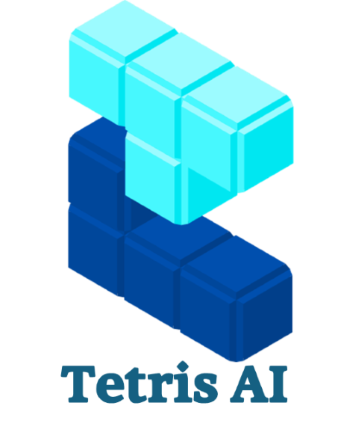
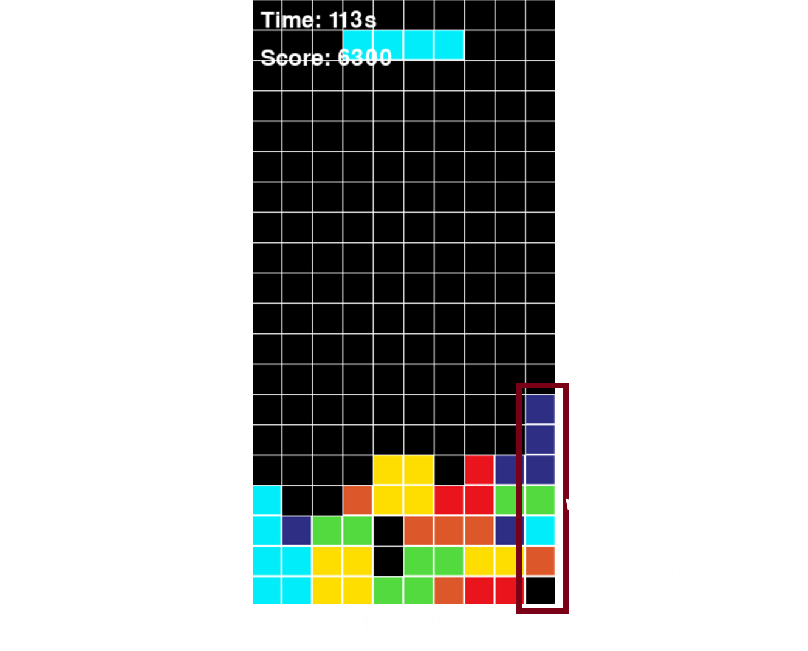
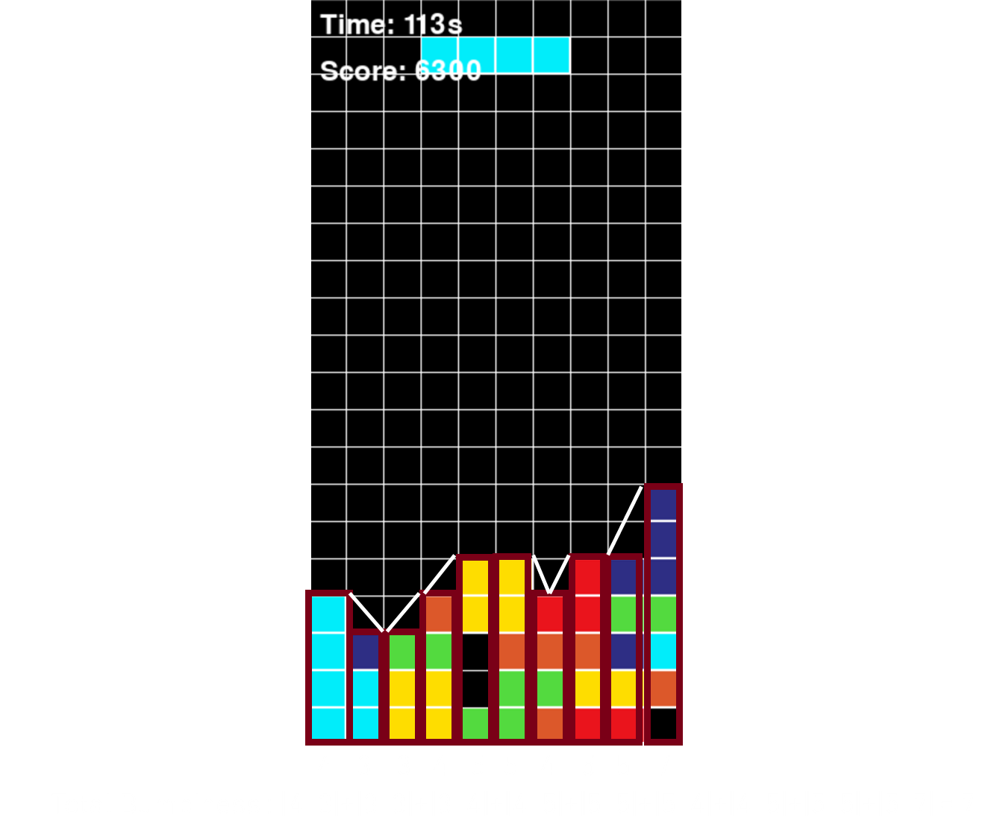
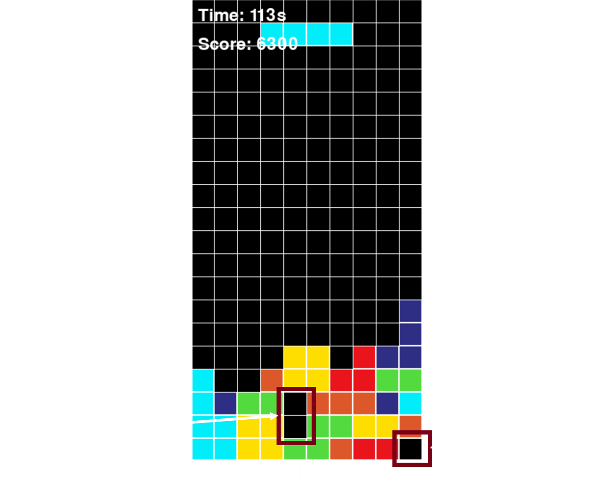
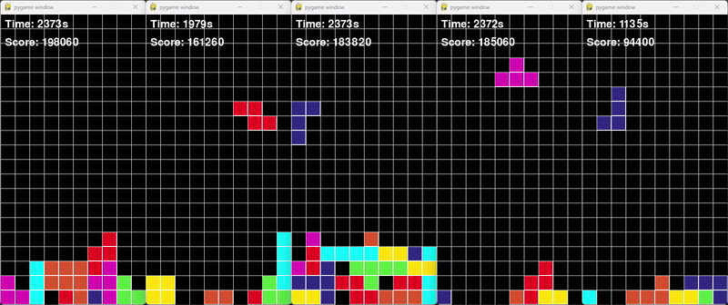
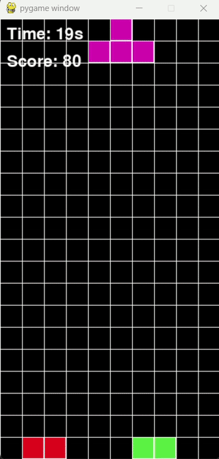
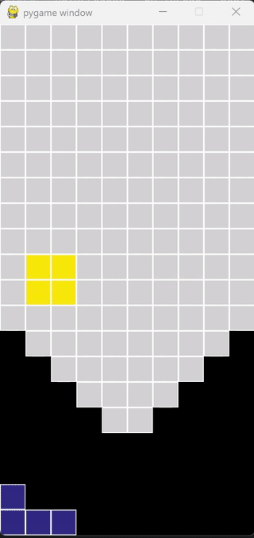
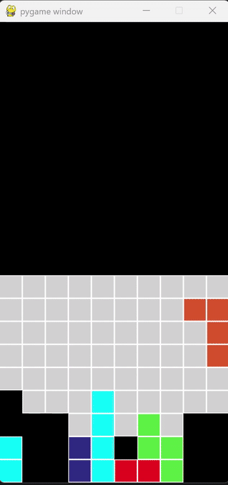
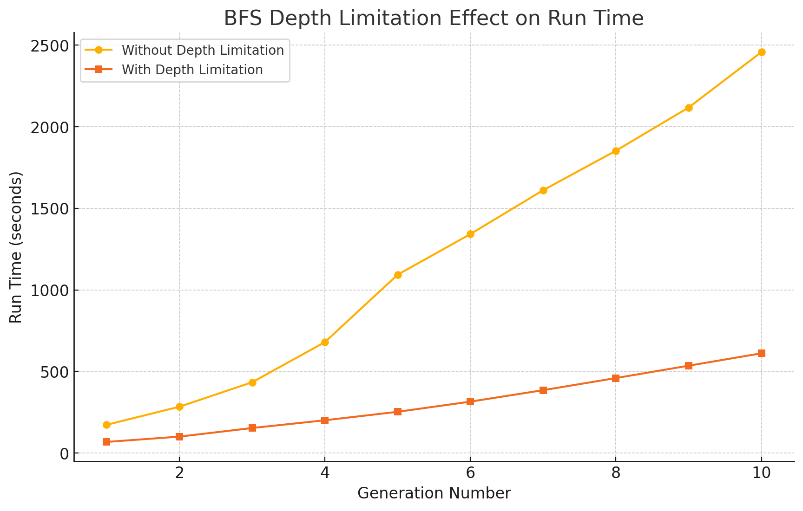

#### By Nitai Edelberg & Ido Toker

# Introduction
### What is Tetris?
Tetris is a classic puzzle game created by Alexey Pajitnov in 1984. The objective of the game is to manipulate falling geometric shapes called Tetriminos to create and clear full horizontal lines on the board. When a line is cleared, it disappears, and the remaining pieces shift downward. The game ends when the stack of pieces reaches the top of the board.


### Basic Rules of Tetris
- **Game Board:** A grid-based playing field, typically 10 columns wide and 20 rows tall.


- **Tetriminos:** Seven different shapes (I, J, L, O, S, T, Z) that can be rotated and moved left or right.

    


- **Goal:** Arrange pieces to form complete rows, which are then cleared for points.


- **Game Over:** The game ends when the stack of pieces reaches the top of the board and no more moves can be made.

## Problem Definition

### Challenges in Tetris AI

The primary challenge of creating an AI for Tetris lies in developing an algorithm that can efficiently decide where to place each piece to maximize the score and delay game over. Since the game is dynamic and unpredictable, an AI must quickly evaluate multiple potential placements while considering both immediate and future consequences. The key difficulties include:

- **Short-term vs. Long-term Decision Making:** A move that clears lines immediately may create issues later by making future placements more difficult or increasing the likelihood of gaps in the board.


- **Scoring Optimization:** The AI must strike a balance between clearing lines quickly for immediate points and strategically setting up future moves for prolonged survival and higher overall scores.


- **Handling Uncertainty:** The AI does not know which pieces will appear next, requiring it to develop strategies that minimize the risk of unfavorable upcoming pieces.


- **Complexity of Board Evaluation:** Unlike static board games, Tetris requires an AI to analyze an ever-changing board state, making it difficult to find universally optimal strategies.


- **Computational Efficiency:** Since new pieces appear continuously and must be placed in real-time, the AI must operate within strict time constraints to ensure smooth gameplay without lag.

## Project Overview
### Goal of the Project

The main goal of our project is to create an AI that learns how to play Tetris and improves over time.
For the learning process, we used Genetic Algorithms (GA), which evolve AI strategies by refining weight-based decision-making through selection, mutation, and crossover.

### Research Process

To understand how to build the AI, we first reviewed various articles on Tetris AI, including research on heuristic-based strategies and evolutionary algorithms[add references]. Additionally, we implemented a human-controlled gameplay mode using keyboard inputs to analyze common strategies.

Based on our research and manual gameplay, we identified four key board features that are crucial for an effective Tetris-playing AI. These features help in evaluating the board state and making informed placement decisions:

- **Max Height:** This refers to the tallest occupied column on the board. A high max height increases the risk of game over, so the AI should aim to minimize it.

- **Bumpiness:** The sum of height differences between adjacent columns. A board with high bumpiness makes it harder to place pieces smoothly, increasing the chances of creating unfillable gaps.

- **Holes:** Empty spaces that are covered by at least one block above them. These are particularly problematic since they cannot be cleared until the covering blocks are removed.

- **Number of Cleared Rows:** The number of full lines removed after a piece placement. Clearing rows is the primary way to keep the board manageable and earn points.

By incorporating these features as weights into our GA, we enabled it to make better strategic decisions when selecting placements for new pieces.

## Genetic Algorithm (GA) Implementation Overview

Our AI uses Genetic Algorithms (GA) to learn how to play Tetris by continuously improving its decision-making through iterative learning over multiple generations that we are running over serval processing cores (since we didn't have access to GPU). The key components of our GA approach are:

- **Weights:** The AI evaluates board states using a weighted scoring system. We use the weights that were mentioned above (max height, bumpiness, holes, cleared rows).


- **Population:** Group of Individuals. Each individual in the population represents a unique set of these weights, forming different strategies for AI decision-making. The weights of each individual were randomly selected initially. A random number between 0 to 1 for the cleared rows and between -1 to 0 for bumpiness, holes and max height.


- **Fitness Function:** The AI plays several rounds of Tetris, and its performance determines its fitness. We determent the fitness score by the average score of each individual rounds, to normalize too high or too low results that may be resulted because of the randomness nature of Tetris. The higher the score, the better the strategy.


- **Selection:** The best-performing individuals are selected for reproduction, ensuring that successful strategies are carried forward. Some percentage of the top Individuals, based on a preselected hyper-parameter, are selected in tournament selection. In this method, small groups (known as tournaments) are created from randomly chosen individuals. The individual with the best fitness scores are selected to reproduce the next generation.


- **Crossover:** The selected individuals undergo a crossover process where a portion of their weight values is exchanged to create offspring with a mix of parental traits. Our implementation uses one-point crossover, where a random point within the weight vector is selected, and the weights beyond this point are swapped between two parents. This approach helps maintain genetic diversity while preserving successful heuristics. Since each weight represents a key factor in evaluating board states (such as bumpiness, max height, and holes), this method ensures that the offspring inherit a combination of effective decision-making strategies.&#x20;


- **Mutation:** Small, random modifications are applied to weights to introduce diversity and explore new strategies. We use Gaussian mutation, where a small random value is added to an existing weight, sampled from a normal distribution centered at zero with a standard deviation proportional to the original weight. This ensures that the AI continues refining its decision-making without overfitting to a specific playstyle.


- **Termination:** The GA runs for a predefined number of generations of a score threshold is reached.

This iterative process allows the AI to refine its gameplay over time, adapting its decision-making by refining the weights of the individual through each iteration. By continuously evolving, the AI can optimize its strategy for long-term survival and higher scores in Tetris.



Now we need to implement a method to scan the board and find the best placement of the next piece that is dropping, evaluating each location in the board based of the individual's weights.

## Column Scanner
The algorithm implements a straightforward brute-force approach to determining the best move for a given Tetris piece. The algorithm iterates over all possible rotations and placements of the current shape, evaluating each configuration based on a heuristic score.

### **How It Works**

The algorithm follows a systematic approach to determining the optimal placement for a Tetris piece. It first explores all possible rotations of the shape, ensuring that every orientation is considered. Once rotated, it evaluates each potential column position where the piece can fit. After identifying valid placements, the piece is simulated to drop to the lowest available row. The resulting board state is then analyzed using our heuristic evaluation metrics. The algorithm tracks the highest-scoring move configuration and stores the sequence of actions required to execute it.

### **Advantages**

- **Simple:** The solver explores most of the possible placements, ensuring it finds a reasonable move given the heuristic evaluation.
- **Effective**: The algorithm places the shapes in the possible placement without simulating the way to get there, thus saving a lot of computing time.
- **Deterministic:** Always chooses the same move for a given board state, making it predictable and easy to debug.

### **Limitations**

- **Limited exploration**: The algorithm places the new piece only on top of the columns, thus missing some options to 'slide under' the new piece below the existing Tetriminos. Limiting the possible moves that are explored and there is no grantee the algorithm will pick the best possible move.



## Breadth-First Search (BFS)

To improve upon the Column Scanner, that can miss placements that aren't at the top of a column ,we implemented BFS, which explores all possible placements for a given piece, **including sliding into gaps**. The BFS algorithm identify all the possible moves and records the way to the best placement during the run.

### **Why BFS Instead of the Simple Solver?** 
The simple solver only considers immediate piece placement without evaluating more complex moves, such as sliding pieces into better positions. The BFS allows the AI to search deeper into the board's state space, considering all the possible placements available on the board, thus significantly enhances AI performance by ensuring more strategic placements and reducing the number of trapped spaces.

### **Advantages:**

- **Guarantees the best move:** Always finds the best move possible because it explores all the valid positions on the board.

- **Handles Complex Moves:** Finds placements involving slides and rotations that a simple height-based solver would miss.

- **Records Best Moves**: Unlike the Column Scanner, the BFS always saves the way it traversed to get to the best placement. Which means we don't need to calculate the path to the best placement separately. This approach simulates a more realistic gameplay.

### **Limitations:**

- **Increased Computational Cost:** BFS requires significantly more processing power than the simple solver due to its exhaustive search.


- **Slower Decision-Making:** While BFS finds better placements, it takes longer to compute, making it less suitable for real-time constraints in some implementations.



By using BFS, our AI achieves a more nuanced understanding of the game, leading to improved decision-making in complex scenarios.


## Optimizations

We implemented several optimizations that enhanced performance and reduced computational costs.

### Limiting Search Depth of BFS

One of the major bottlenecks in our initial BFS implementation was the exhaustive search of all possible placements, leading to high computation times. To address this, we optimized BFS by **limiting the search depth to six rows above the maximum height** of the board. This reduced the number of evaluated states and cut BFS execution time by approximately **70%**, significantly improving real-time performance without sacrificing decision quality.

 



### Hyperparameter Optimization in GA

To enhance learning efficiency, we fine-tuned the hyperparameters of our **Genetic Algorithm (GA)**. Key adjustments included:

- **Mutation Rate**: Adjusted to maintain diversity while ensuring convergence. After testing hours of games we found that mutation of 0.35 and arity of 10 helps the learning proccess grow. 
- **Crossover Probability**: Tuned to balance exploration and exploitation. After long research we found out that crossover of 0.65 and arity of 2 helps the learning GA.
- **Tournament Selection Parameters**: Optimized selection pressure to ensure strong individuals continue while maintaining population diversity.
- **Elitism Rate**: The individuals that are passed to the next generation, and from them we do the crossovers and mutations. we maintain 0.2 of the best Individuals.

[ADD GRAPH SHOWING THE EXPIREMENTS. WRITE THE VALUES WE ENDED UP WITH]

These refinements improved the AI’s learning process, leading to more consistent and effective gameplay strategies.

### Adding Shape Placement

Previously, our AI evaluated board states using four primary weights: bumpiness, max height, holes, and cleared rows. To improve placement decision-making, we introduced a fifth weight called shape placement. This weight measures how low a newly placed shape lands on the board, encouraging more compact stacking and reducing the likelihood of creating inaccessible gaps.

### Experimenting with Hole Difference Calculation

We experimented with an additional heuristic: **hole difference calculation**, which aimed to track the change in the number of holes after placing a piece. However, in practice, this did not yield meaningful improvements in AI performance. The added computational cost outweighed any benefits, so we ultimately decided not to include this feature in our final implementation.

By implementing these optimizations, we improved both the efficiency and strategic depth of our AI, allowing it to make better decisions in real time while reducing unnecessary computation.


## Experiments & Results
### How We Tested the AI
- BFS and GA were tested on multiple game runs.
- We measured scores, cleared lines, and survival duration.

### Experimental Findings
- **Graphs comparing BFS with GA performance.**
- **Insights on when each approach performs best.**


## **Code Overview**

### **Genetic Algorithm (GA) Modules**

#### • `TetrisGeneticAlgorithm.py`

- Uses the Eckity framework to implement a genetic algorithm that optimizes Tetris AI performance through evolution.
- The `TetrisGeneticAlgorithm` class initializes a genetic algorithm with a defined population size and selection strategy.
- It employs Tournament Selection for choosing parents and applies WeightCrossover and WeightMutation to evolve individuals.
- `run_ga` executes the genetic algorithm in a separate thread, running multiple generations until a termination condition is met.
- The best-performing AI weights are selected based on fitness scores obtained from Tetris game simulations.

#### • `Genetics.py`

- Defines genetic operations for AI weight optimization.
- `WeightCreator` (extends `Creator` from Eckity): Generates initial populations of AI individuals.
- `WeightIndividual` (extends `Individual` from Eckity): Represents a Tetris-playing AI with weight-based heuristics.
- `WeightCrossover` (extends `GeneticOperator` from Eckity): Implements crossover by swapping weight segments.
- `WeightMutation` (extends `GeneticOperator` from Eckity): Mutates weights using a Gaussian distribution.

#### • `GenerationTerminationChecker.py`

- Implements stopping criteria for the genetic algorithm.
- `GenerationTerminationChecker` (extends `TerminationChecker` from Eckity): Stops evolution when the generation limit or a fitness threshold is reached.

#### • `Evaluator.py`

- Evaluates AI performance using game simulations.
- `Evaluator` (extends `SimpleIndividualEvaluator` from Eckity): Runs the AI for multiple rounds and computes the average score.
- `evaluate individual`: Uses `run_tetris_game` with given AI individual to play Tetris with different weights and calculates performance.

#### • `PopulationEvaluator.py`

- Evaluates the entire population of AI agents in parallel.
- `PopulationEvaluator` (extends `SimplePopulationEvaluator` from Eckity): Uses multiprocessing for efficiency.
- Assigns fitness scores to individuals based on their game performance.

### **AI Player Modules**

#### • `AIAgent.py`

- Defines the AI agent that plays Tetris.
- Uses heuristic weights (`bumpiness`, `holes`, `max height`, etc.).
- `choose_action`: Uses the AIBrain to decide the best move based on board evaluation.

#### • `AIBrain.py`

- Calculates the best moves when needed, using heuristics.
- `find_best_placement`: Uses BFS to explore and evaluate moves for optimal shape placement.


### **Gameplay Modules**

#### • `GameSetup.py`

- Handles the game loop and AI interaction.
- Supports human vs AI gameplay and AI-only mode.
- `run_tetris_game`: Runs the game in AI-only mode and returns the score.
- Uses Pygame for rendering graphical elements.

#### • `Display.py`

- Handles Tetris board rendering using Pygame.
- Draws shapes, grids, scores, and game over messages.
- Functions include:
  - `draw_board`: Displays the game board and current state.
  - `draw_shape`: Draws Tetris pieces on the screen.
  - `draw_timer_and_score`: Displays score and elapsed time.

#### • `Table.py`

- Defines the **Tetris board** and shape mechanics.
- Implements shape movement, collision detection, and row clearing.
- `spawn_next_shape`: Generates the next Tetris shape and places it at the starting position.
- Tracks game statistics like bumpiness, max height, and holes.

#### • `Definitions.py`

- Stores game settings and constants.
- Defines grid size, colors, shapes, and scoring system.

---

### **Project Summary**

This project implements **Tetris AI using a genetic algorithm**. The AI improves by **evolving weights** over multiple generations. The AI plays Tetris by **evaluating board states** using heuristics. The game supports **human vs AI** and **AI-only modes** with **graphical rendering**.


## Future Improvements & Conclusions
### Alternative AI Approaches
- Exploring Reinforcement Learning for better long-term strategy.
- needed complex claculation force to leran faster. each change in hyper paramters takes hours of runing  TODO

### Conclusions
- The AI game solver playes better and faster then the human (probblay better then the best tetris player in the world). the scores reach more then score of 100,000 *without calculting score that grow with levels
- Using different processors without graphics is needed to shorter each generation running time.
- Finding the hyper paramters for the GA aboulatuon is the main problem based on calaculation time and complexity.

## How to Use
### Installation & Running the Game
```bash
pip install pygame numpy eckity
python GameSetup.py  # Run player mode
python TetrisGeneticAlgorithm.py  # Run GA-based AI
```

## References
- [Genetic Algorithm in AI](https://www.mdpi.com/2078-2489/10/12/390)
- [Tetris AI Mechanics](https://tetris.fandom.com/wiki/Tetris_AI)

## License
Specify license type here.

For further improvements and contributions, feel free to fork and contribute!

