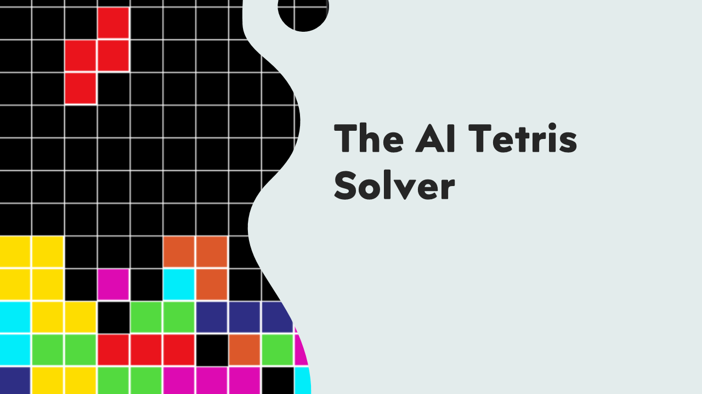
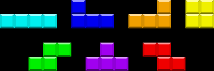
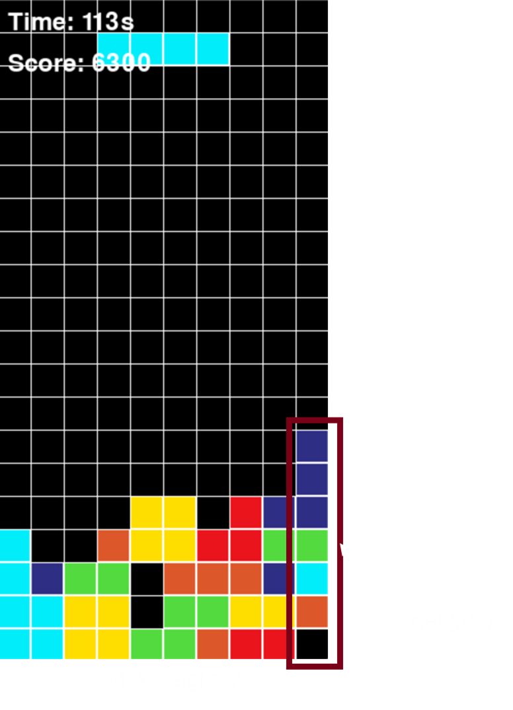
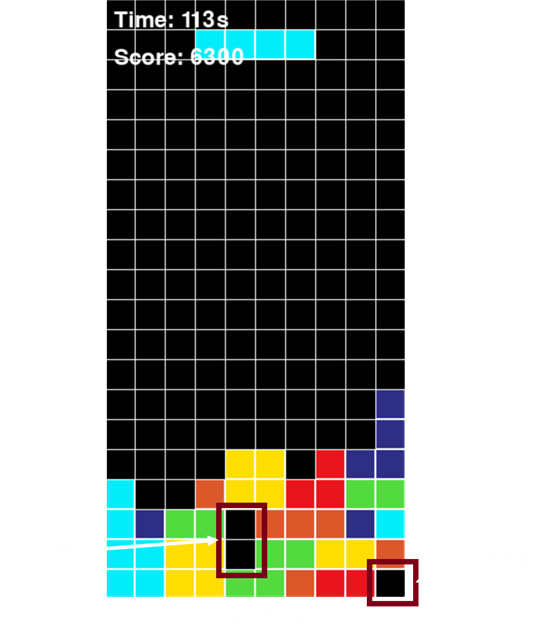

# Tetris AI Solver


`By Nitai Edelberg & Ido Toker`

## Introduction
### What is Tetris?
Tetris is a classic puzzle game created by Alexey Pajitnov in 1984. The objective of the game is to manipulate falling geometric shapes called Tetriminos to create and clear full horizontal lines on the board. When a line is cleared, it disappears, and the remaining pieces shift downward. The game ends when the stack of pieces reaches the top of the board.

### Basic Rules of Tetris
- **Game Board:** A grid-based playing field, typically 10 columns wide and 20 rows tall.
- **Tetriminos:** Seven different shapes (I, J, L, O, S, T, Z) that can be rotated and moved left or right.
    
- **Goal:** Arrange pieces to form complete rows, which are then cleared for points.
- **Game Over:** The game ends when the stack of pieces reaches the top of the board and no more moves can be made.

## Problem Definition

### Challenges in Tetris AI

The primary challenge of creating an AI for Tetris lies in developing an algorithm that can efficiently decide where to place each piece to maximize the score and delay game over. Since the game is dynamic and unpredictable, an AI must quickly evaluate multiple potential placements while considering both immediate and future consequences. The key difficulties include:

- **Short-term vs. Long-term Decision Making:** A move that clears lines immediately may create issues later by making future placements more difficult or increasing the likelihood of gaps in the board.


- **Scoring Optimization:** The AI must strike a balance between clearing lines quickly for immediate points and strategically setting up future moves for prolonged survival and higher overall scores.


- **Handling Uncertainty:** The AI does not know which pieces will appear next, requiring it to develop strategies that minimize the risk of unfavorable upcoming pieces.


- **Complexity of Board Evaluation:** Unlike static board games, Tetris requires an AI to analyze an ever-changing board state, making it difficult to find universally optimal strategies.


- **Computational Efficiency:** Since new pieces appear continuously and must be placed in real-time, the AI must operate within strict time constraints to ensure smooth gameplay without lag.

## Project Overview
### Goal of the Project

The main goal of our project is to create an AI that learns how to play Tetris and improves over time.
For the learning process, we used Genetic Algorithms (GA), which evolve AI strategies by refining weight-based decision-making through selection, mutation, and crossover.

### Research Process

To understand how to build the AI, we first reviewed various articles on Tetris AI, including research on heuristic-based strategies and evolutionary algorithms[add references]. Additionally, we implemented a human-controlled gameplay mode using keyboard inputs to analyze common strategies.

Based on our research and manual gameplay, we identified four key board features that are crucial for an effective Tetris-playing AI. These features help in evaluating the board state and making informed placement decisions:

- **Max Height:** This refers to the tallest occupied column on the board. A high max height increases the risk of game over, so the AI should aim to minimize it.

- **Bumpiness:** The sum of height differences between adjacent columns. A board with high bumpiness makes it harder to place pieces smoothly, increasing the chances of creating unfillable gaps.

- **Holes:** Empty spaces that are covered by at least one block above them. These are particularly problematic since they cannot be cleared until the covering blocks are removed.

- **Number of Cleared Rows:** The number of full lines removed after a piece placement. Clearing rows is the primary way to keep the board manageable and earn points.

By incorporating these features as weights into our GA, we enabled it to make better strategic decisions when selecting placements for new pieces.

### Genetic Algorithm (GA) Implementation Overview

Our AI uses Genetic Algorithms (GA) to learn how to play Tetris by continuously improving its decision-making through iterative learning over multiple generations that we are running over serval processing cores (since we didn't have access to GPU). The key components of our GA approach are:

- **Weights:** The AI evaluates board states using a weighted scoring system. We use the weights that were mentioned above (max height, bumpiness, holes, cleared rows).


- **Population:** Group of Individuals. Each individual in the population represents a unique set of these weights, forming different strategies for AI decision-making. The weights of each individual were randomly selected initially. A random number between 0 to 1 for the cleared rows and between -1 to 0 for bumpiness, holes and max height.


- **Fitness Function:** The AI plays several rounds of Tetris, and its performance determines its fitness. We determent the fitness score by the average score of each individual rounds, to normalize too high or too low results that may be resulted because of the randomness nature of Tetris. The higher the score, the better the strategy.


- **Selection:** The best-performing individuals are selected for reproduction, ensuring that successful strategies are carried forward. Some percentage of the top Individuals, based on a preselected hyper-parameter, are selected in tournament selection. In this method, small groups (known as tournaments) are created from randomly chosen individuals. The individual with the best fitness scores are selected to reproduce the next generation.


- **Crossover:** The selected individuals undergo a crossover process where a portion of their weight values is exchanged to create offspring with a mix of parental traits. Our implementation uses one-point crossover, where a random point within the weight vector is selected, and the weights beyond this point are swapped between two parents. This approach helps maintain genetic diversity while preserving successful heuristics. Since each weight represents a key factor in evaluating board states (such as bumpiness, max height, and holes), this method ensures that the offspring inherit a combination of effective decision-making strategies.&#x20;


- **Mutation:** Small, random modifications are applied to weights to introduce diversity and explore new strategies. We use Gaussian mutation, where a small random value is added to an existing weight, sampled from a normal distribution centered at zero with a standard deviation proportional to the original weight. This ensures that the AI continues refining its decision-making without overfitting to a specific playstyle.


- **Termination:** The GA runs for a predefined number of generations of a score threshold is reached.

This iterative process allows the AI to refine its gameplay over time, adapting its decision-making by refining the weights of the individual through each iteration. By continuously evolving, the AI can optimize its strategy for long-term survival and higher scores in Tetris.

Now we need to implement a method to scan the board and find the best placement of the next piece that is dropping, evaluating each location in the board based of the individual's weights.

## Basic Solver
based on low rows.......

## Breadth-First Search (BFS)

To improve upon the basic solver, that can miss placements that aren't at the top of a column ,we implemented BFS, which explores all possible placements for a given piece, **including sliding into gaps**. The BFS algorithm identify all the possible moves and records the way to the best placement during the run.

**Why BFS Instead of the Simple Solver?** The simple solver only considers immediate piece placement without evaluating more complex moves, such as sliding pieces into better positions. The BFS allows the AI to search deeper into the board's state space, considering all the possible placements available on the board, thus significantly enhances AI performance by ensuring more strategic placements and reducing the number of trapped spaces.

**Advantages of BFS Over the Simple Solver:**

- **Handles Complex Moves:** Finds placements involving slides and rotations that a simple height-based solver would miss.


- **Records Best Moves**: Unlike the basic search, the BFS always saves the way it traversed to get to the best placement. Which means we don't need to calculate the path to the best placement separately.

**Limitations of BFS:**

- **Increased Computational Cost:** BFS requires significantly more processing power than the simple solver due to its exhaustive search.


- **Slower Decision-Making:** While BFS finds better placements, it takes longer to compute, making it less suitable for real-time constraints in some implementations.

By using BFS, our AI achieves a more nuanced understanding of the game, leading to improved decision-making in complex scenarios.


## Optimisations

## Experiments & Results
### How We Tested the AI
- BFS and GA were tested on multiple game runs.
- We measured scores, cleared lines, and survival duration.

### Experimental Findings
- **Graphs comparing BFS with GA performance.**
- **Insights on when each approach performs best.**

## Future Improvements & Conclusions
### Alternative AI Approaches
- Exploring Reinforcement Learning for better long-term strategy.

### Conclusions
- BFS with weights consideration aren't steady. We noticed that although the BFS scans all the possible places when searching for the next piece, it sometimes doesn't choose the "right" placement. We tested the model with BFS simulation over our board.
- Using different processors without graphics is needed to shorter each generation running time.
- Finding the hyper paramters for the GA aboulatuon is the main problem based on calaculation time and complexity

## How to Use
### Installation & Running the Game
```bash
pip install pygame numpy eckity
python GameSetup.py  # Run player mode
python TetrisGeneticAlgorithm.py  # Run GA-based AI
```

## References
- [Genetic Algorithm in AI](https://www.mdpi.com/2078-2489/10/12/390)
- [Tetris AI Mechanics](https://tetris.fandom.com/wiki/Tetris_AI)

## License
Specify license type here.

For further improvements and contributions, feel free to fork and contribute!

