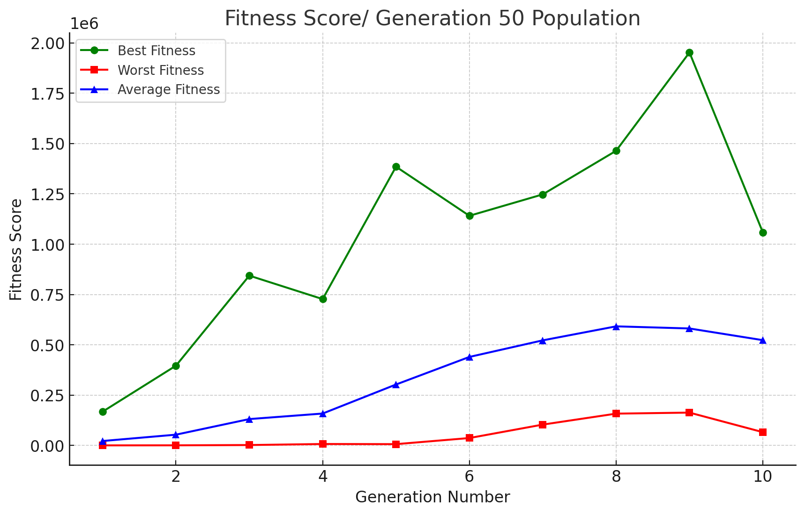

### By Nitai Edelberg & Ido Toker

# Project Summary
This project implements Tetris AI using a genetic algorithm. The AI learns and improves by evolving its weights over multiple generations. The AI plays Tetris by evaluating board states using heuristics. The game supports human vs. AI and AI-only modes with graphical rendering.


---
# Introduction

### What is Tetris?
Tetris is a classic puzzle game created by Alexey Pajitnov in 1984. The game's objective is to manipulate falling geometric shapes called Tetriminos to create full horizontal lines on the board. When a line is completed, it disappears, and the remaining pieces shift downward. The game ends when the stack of pieces reaches the top of the board.


### Basic Rules of Tetris
- **Game Board:** A grid-based playing field, typically 10 columns wide and 20 rows tall.


- **Tetriminos:** Seven different shapes (I, J, L, O, S, T, Z) that can be rotated and moved left or right.


- **Goal:** Arrange pieces to form complete rows, which are then cleared for points.


- **Scoring:**

  - 40 points for a 'Single' (one row)

  - 100 points for a 'Double' (two rows)

  - 300 points for a 'Triple' (three rows)
  
  - 1200 points for a 'Tetris' (four rows)


- **Game Over:** The game ends when the stack of pieces reaches the top of the board and no more moves can be made.

---

## Problem Definition

### Challenges in Tetris AI

The primary challenge of creating an AI for Tetris lies in developing an algorithm that can efficiently decide where to place each piece to maximize the score and delay the game over. Since the game is dynamic and unpredictable, an AI must quickly evaluate multiple potential placements while considering both immediate and future consequences. The key difficulties include:

- **Short-term vs. Long-term Decision Making:** A move that clears lines immediately may create issues later by making future placements more difficult or increasing the likelihood of gaps in the board.


- **Scoring Optimization:** The AI must strike a balance between clearing lines quickly for immediate points and strategically setting up future moves for prolonged survival and higher overall scores.


- **Complexity of Board Evaluation:** Unlike static board games, Tetris requires an AI to analyze an ever-changing board state, making it difficult to find universally optimal strategies.


- **Computational Efficiency:** Since new pieces appear continuously and must be placed in real time, the AI must operate within strict time constraints to ensure smooth gameplay without lag.

---

## Project Overview
### Goal of the Project

The main goal of our project is to create an AI that learns how to play Tetris and improves over time.
For the learning process, we used a Genetic Algorithm (GA), which evolves AI strategies by refining weight-based decision-making through selection, mutation, and crossover.

### Research Process

To understand how to build a strong AI for Tetris, we first reviewed various articles on the subject, including research on heuristic-based strategies and evolutionary algorithms. Additionally, we implemented a human-controlled gameplay mode using keyboard inputs to analyze common strategies.

Based on our research and manual gameplay, we identified four key board features that are crucial for an effective Tetris-playing AI. These features help in evaluating the board state and making informed placement decisions:

- **Max Height:** This refers to the tallest occupied column on the board. A high max height increases the risk of game over, so the AI should aim to minimize it.


- **Bumpiness:** The sum of height differences between adjacent columns. A board with high bumpiness makes it harder to place pieces smoothly, increasing the chances of creating unfillable gaps.


- **Holes:** Empty spaces that are covered by at least one block above them. These are particularly problematic since they cannot be cleared until the covering blocks are removed.


- **Number of Cleared Rows:** The number of full lines removed after a piece placement. Clearing rows is the primary way to keep the board manageable and earn points.

By incorporating these features as weights into our GA, we enabled it to make better strategic decisions when selecting placements for new pieces.


---

## Genetic Algorithm Implementation Overview

Our AI uses Genetic Algorithms (GA) to learn how to play Tetris by continuously improving its decision-making through iterative learning over multiple generations that we are running over several processing cores (since we didn't have access to GPU). The key components of our GA approach are:

- **Weights:** The AI evaluates board states using a weighted scoring system. We use the weights that were mentioned above (max height, bumpiness, holes, cleared rows).


- **Population:** Group of Individuals. Each individual in the population represents a unique set of these weights, forming different strategies for AI decision-making. The weights of each individual were randomly selected initially. A random number between 0 to 1 for the cleared rows and between -1 to 0 for bumpiness, holes, and max height.


- **Fitness Function:** The AI plays several rounds of Tetris, and its performance determines its fitness. We determine the fitness score by the average score of all the rounds of each individual, to normalize scores that are too high or too low that may result because of the random nature of Tetris. The higher the score, the better the strategy.


- **Selection:** The best-performing individuals are selected for reproduction, ensuring that successful strategies are carried forward. A percentage of the top individuals, based on a preselected hyper-parameter, are selected using tournament selection. In this method, small groups (known as tournaments) are created from randomly chosen individuals. The individual with the best fitness scores is selected to reproduce the next generation.


- **Crossover:** The selected individuals undergo a crossover process where a portion of their weight values is exchanged to create offspring with a mix of parental traits. Our implementation uses a one-point crossover, where a random point within the weight vector is selected, and the weights beyond this point are swapped between two parents. This approach helps maintain genetic diversity while preserving successful heuristics. Since each weight represents a key factor in evaluating board states (such as bumpiness, max height, and holes), this method ensures that the offspring inherit a combination of effective decision-making strategies.&#x20;


- **Mutation:** Small, random modifications are applied to weights to introduce diversity and explore new strategies. We use Gaussian mutation, where a small random value is added to an existing weight, sampled from a normal distribution centered at zero with a standard deviation proportional to the original weight. This ensures that the AI continues refining its decision-making without overfitting to a specific playstyle.


- **Termination:** The GA runs for a predefined number of generations or a score threshold is reached.

This iterative process allows the AI to refine its gameplay over time, adapting its decision-making by refining the weights of the individual through each iteration. By continuously evolving, the AI can optimize its strategy for long-term survival and higher scores in Tetris.


Now we need to implement a method to scan the board and find the best placement of the next piece that is dropping, evaluating each location in the board based on the individual's weights.

---


## Breadth-First Search (BFS)

We implemented an algorithm that works like a BFS, which explores all possible placements for a given piece, including sliding into gaps. The BFS algorithm identifies all the possible moves and records the way to the best placement during the run.

### **Advantages:**

- **Guarantees the best move:** Always finds the best move possible because it explores all the valid positions on the board.


- **Handles Complex Moves:** Finds placements involving slides and rotations that a simple height-based solver would miss.


- **Records Best Moves**: Unlike the Column Scanner, the BFS always saves the way it traverses to get to the best placement. This means we don't need to calculate the path to the best placement separately. This approach simulates a more realistic gameplay.

### **Limitations:**

- **Increased Computational Cost:** BFS requires significantly more processing power than the simple solver due to its exhaustive search.


- **Slower Decision-Making:** While BFS finds better placements, it takes longer to compute, making it less suitable for real-time constraints in some implementations.


By using BFS, our AI achieves a more nuanced understanding of the game, leading to improved decision-making in complex scenarios.

## Column Scanner
Due to the BFS algorithm's mediocre performance (see the experiment & results segment) we implemented a simpler and faster algorithm to see if it will work better.

The 'Column Scanner' algorithm implements a straightforward approach to determining the best move for a given Tetris piece. The algorithm iterates over all possible rotations and placements of the current shape on top of each column, evaluating each configuration based on a heuristic score.

### **How It Works**

The algorithm follows a systematic approach to determining the optimal placement for a Tetris piece. It first explores all possible rotations of the shape, ensuring that every orientation is considered. Once rotated, it evaluates each potential column position where the piece can fit. After identifying valid placements, the piece is simulated to drop to the lowest available row. The resulting board state is then analyzed using our heuristic evaluation metrics. The algorithm tracks the highest-scoring move configuration and stores the sequence of actions required to execute it.

### **Advantages**

- **Simple:** The solver explores most of the possible placements, ensuring it finds a reasonable move given the heuristic evaluation.


- **Effective**: The algorithm places the shapes in the possible placement without simulating the way to get there, thus saving a lot of computing time.


- **Deterministic:** Always chooses the same move for a given board state, making it predictable and easy to debug.

### **Limitations**

- **Limited exploration**: The algorithm places the new piece only on top of the columns, thus missing some options to 'slide under' the new piece below the existing Tetriminos. Limiting the possible moves that are explored and there is no guarantee the algorithm will pick the best possible move.


---
## Optimizations

We implemented several optimizations that enhanced performance and reduced computational costs.

### GA simulation without graphics

We added the option to run the GA simulation without the Pygame graphics, using only logs and reports. This reduced the runtime by around **80%**.

### Limiting Search Depth of BFS

One of the major bottlenecks in our initial BFS implementation was the exhaustive search of all possible placements, leading to high computation times. To address this, we optimized BFS by **limiting the search depth to six rows above the maximum height** of the board. This reduced the number of evaluated states and cut BFS execution time by approximately **70%**, significantly improving real-time performance without sacrificing decision quality.

 


### Hyperparameter Optimization in GA

To enhance learning efficiency, we fine-tuned the hyperparameters of our **Genetic Algorithm (GA)**. Key adjustments included:

- **Mutation Rate**: Adjusted to maintain diversity while ensuring convergence. After testing hours of games we found that mutation of 0.35 and arity of 10 helps the learning process grow to the best score possible while converging in a reasonable time. 


- **Crossover Probability**: Tuned to balance exploration and exploitation. After long research, we found out that a crossover of 0.65 and an arity of 2 helps to balance the mutation rate.


- **Tournament Selection Parameters**: Optimized selection pressure to ensure strong individuals continue while maintaining population diversity.


- **Elitism Rate**: The individuals that are passed to the next generation, and from them we do the crossovers and mutations. We maintain 0.3 of the best Individuals.

(see experiments below)


These refinements improved the AI’s learning process, leading to more consistent and effective gameplay strategies.

### Experimenting with Shape Placement

Previously, our AI evaluated board states using four primary weights: bumpiness, max height, holes, and cleared rows. To improve placement decision-making, we added a fifth weight called shape placement. This weight measures how low a newly placed shape lands on the board, encouraging more compact stacking. After running the model with this fifth weight we found out that this weight is redundant and similar to bumpiness - they have the same effect.

### Experimenting with Hole Difference Calculation

We experimented with an additional heuristic: **hole difference calculation**, which aimed to track the change in the number of holes after placing a piece. However, in practice, this did not yield meaningful improvements in AI performance. The added computational cost outweighed any benefits, so we ultimately decided not to include this feature in our final implementation.

By implementing these optimizations, we improved both the efficiency and strategic depth of our AI, allowing it to make better decisions in real-time while reducing unnecessary computation.

---

## Experiments & Results
### How We Tested the AI
-  We used the `TetrisGeneticAlgorithm` class to run the genetic algorithm process with the wanted parameters. This class allowed us to execute the GA, gain logs of each generation, and analyze the results through graphs.


- We measured scores, cleared lines, and survival duration.

### Experimental Findings
**Notice** : The following experiments are shorter than we wanted due to our limited computation power. Each experiment required long hours (some more than 24 hours) of runtime due to the high game results.

### BFS experiments

#### Experiment's Data


#### BFS Insights

- For the BFS algorithm Larger populations achieve better results – The 50-population experiment produced the highest fitness scores, showing that a larger gene pool helps evolve stronger solutions.


- More stable improvement with larger populations – The 50-population experiment showed steady progress, while the 20-population case had fluctuations and inconsistent growth and the 30-population improved over time but had some fluctuations, especially after generation 7.


- Smaller populations struggle with weak individuals – The worst fitness scores were lower in larger populations, indicating that smaller populations suffer more from poor-performing individuals.


- Smaller populations converge faster but less effectively – The 20-population experiment improved quickly but plateaued early, while the 50-population case took longer to evolve but achieved superior results.

### Column Scan Experiments

#### Experiment's Data
Each experiment required even longer hours of runtime than the BFS, due to the high-quality game results, in some point they reached over 10,000,000 points (a single game's simulation with such results takes over an hour):




#### Column scan Insights

- Column scan results show higher fitness scores compared to BFS, suggesting that this approach may be more effective in finding optimal solutions. However, the column scan results appear less stable than the BFS results, as indicated by the fact that the 20-population run performed way better than the 30 and the 50-population runs, probably due to a few strong individuals at the first generation and small population.


- Larger populations provide more stable progression – The 50-population experiment exhibited smoother and more consistent improvements in fitness scores, while the 20-population case had significant fluctuations and abrupt jumps in performance. The 30-population experiment showed a balance, with some variability, particularly after generation 7.


- Smaller populations evolve more quickly but are more likely to plateau – The 20-population experiment reached high fitness early but showed signs of plateauing, while the 50-population case took longer to evolve but demonstrated a more reliable trajectory toward long-term improvement. The 30-population case offered a middle ground, balancing speed and stability.

### Hyper-parameters experiments

To check convergence, we limited each game to a maximum of 2,500 Terminos that can be placed on the board.
#### Experiment's Data


Converge around generation 7-8.
Best score: 53,660


Converge around generation 11-12.
Best score: 55,040 


Converge around generation 14-15.
Best score: 56,056


Converge around generation 17-18.
Best score: 56,772 

#### Experiment's Insights

Analyzing different mutation and crossover probabilities highlighted their varying effects on convergence speed and solution quality. Lower mutation rates, like 0.05, with high crossover rates, like 0.95, enabled faster convergence, reaching the optimal in around 7 generations. In contrast, higher mutation rates, such as 0.25 and 0.35, and lower crossover rates, such as 0.75 and 0.65, prolonged the convergence process, requiring more generations to attain the best solution.

### Overall Findings

- The optimal weights are **[-0.1734635637226034, -0.031100166230100215, -0.8795480715944236, 0.18896266945641163]** (Bumpiness, Max height, Holes, Cleared rows)

---

## **Code Overview**

### **Genetic Algorithm (GA) Modules**

#### • `TetrisGeneticAlgorithm.py`

- Uses the Eckity framework to implement a genetic algorithm that optimizes Tetris AI performance through evolution.
- The `TetrisGeneticAlgorithm` class initializes a genetic algorithm with a defined population size and selection strategy.
- It employs Tournament Selection for choosing parents and applies WeightCrossover and WeightMutation to evolve individuals.
- `run_ga` executes the genetic algorithm in a separate thread, running multiple generations until a termination condition is met.
- The best-performing AI weights are selected based on fitness scores obtained from Tetris game simulations.

#### • `Genetics.py`

- Defines genetic operations for AI weight optimization.
- `WeightCreator` (extends `Creator` from Eckity): Generates initial populations of AI individuals.
- `WeightIndividual` (extends `Individual` from Eckity): Represents a Tetris-playing AI with weight-based heuristics.
- `WeightCrossover` (extends `GeneticOperator` from Eckity): Implements crossover by swapping weight segments.
- `WeightMutation` (extends `GeneticOperator` from Eckity): Mutates weights using a Gaussian distribution.

#### • `GenerationTerminationChecker.py`

- Implements stopping criteria for the genetic algorithm.
- `GenerationTerminationChecker` (extends `TerminationChecker` from Eckity): Stops evolution when the generation limit or a fitness threshold is reached.

#### • `Evaluator.py`

- Evaluate AI performance using game simulations.
- `Evaluator` (extends `SimpleIndividualEvaluator` from Eckity): Runs the AI for multiple rounds and computes the average score.
- `evaluate individual`: Uses `run_tetris_game` with a given AI individual to play Tetris with different weights and calculate performance.

#### • `PopulationEvaluator.py`

- Evaluates the entire population of AI agents in parallel.
- `PopulationEvaluator` (extends `SimplePopulationEvaluator` from Eckity): Uses multiprocessing for efficiency.
- Assign fitness scores to individuals based on their game performance.

### **AI Player Modules**

#### • `AIAgent.py`

- Defines the AI agent that plays Tetris.
- Uses heuristic weights (`bumpiness`, `holes`, `max-height`, etc.).
- `choose_action`: Uses the AIBrain to decide the best move based on board evaluation.

#### • `AIBrain.py`

- Calculates the best moves when needed, using heuristics.
- `find_best_placement_bfs`: Uses BFS to explore and evaluate moves for optimal shape placement.
- `find_best_placement_column_scan`: Uses the column scan method to explore and evaluate moves for simpler and faster placements.


### **Gameplay Modules**

#### • `GameSetup.py`

- Handles the game loop and AI interaction.
- Supports human vs. AI gameplay, AI-only mode, and human-only mode.
- `run_tetris_game`: Runs the game and returns the score.
- Uses Pygame for rendering graphical elements.

#### • `AIGameSimulator.py`

- Defines the function `run_tetris_game` that runs the AI simulation in the GA. The function run_tetris_game defines the game loop for the AI player. It receives an AI agent and a maximum number of pieces in a game to limit the run due to high scores and high computation time.

#### • `HumanHandler.py`

- Defines HumanHandler class that manages human play and listening for input keyboard presses for actions.

#### • `AIHandler.py`

- Defines AIHandler class that manages the AI play with AIAgent instance that holds the weights through which the AI Agent manages its game strategy.

#### • `Display.py`

- Handles Tetris board rendering using Pygame.
- Draws shapes, grids, scores, and game over messages.
- Functions include:
  - `draw_board`: Displays the game board and current state.
  - `draw_shape`: Draws Tetris pieces on the screen.
  - `draw_timer_and_score`: Displays score and elapsed time.

#### • `Table.py`

- Defines the **Tetris board** and shape mechanics.
- Implements shape movement, collision detection, and row clearing.
- `spawn_next_shape`: Generates the next Tetris shape and places it at the starting position.
- Tracks game statistics like bumpiness, max height, and holes.

#### • `Definitions.py`

- Stores game settings and constants.
- Defines grid size, colors, shapes, and scoring system.

---

### **Eckity Framework**
Eckity is a Python framework designed for building genetic algorithms, providing the structure for individuals, populations, and genetic operations like selection, crossover, and mutation. It serves as the foundational framework in our project, allowing us to implement and customize a genetic algorithm to optimize the performance of the Tetris AI.

In our implementation, we extended Eckity's core components to tailor them for Tetris optimization. Specifically, we enhanced the genetic operations (selection, crossover, and mutation) for evolving AI weights. We also customized the evaluator to simulate Tetris games and assess the performance of AI agents based on their weight configurations.

By using the Eckity framework and adjusting these custom features, we were able to create a system that evolves Tetris-playing AI agents and optimizes their performance through genetic algorithms.

---

## Future Improvements & Conclusions
### Improvements
- Exploring Reinforcement Learning for better long-term strategy.


- We are currently running our genetic algorithm on 10 processes, but each learning cycle with generations takes **many hours** due to the complexity and large number of calculations. To speed up the learning process, we need more powerful computing resources, such as powerful GPU or AWS instances, to handle the intensive computations required for optimizing hyperparameters efficiently.

### Conclusions
- The AI game solver plays better and faster than a human. The scores exceed **10,000,000 points**. This incredibly high score was recorded in the 7th generation of the Column Scan algorithm.


- Using multiple processors without relying on CPUs is necessary to reduce the runtime of each generation.


- Tuning the hyperparameters for the genetic algorithm is the main challenge due to the high computational cost and complexity.


- The results showed that the column-scan algorithm performed better than the BFS-based scan, despite being a simpler approach. This was surprising, as BFS is generally expected to explore a more diverse range of placements. The column-scan method's effectiveness suggests that directly evaluating placements in a structured manner may lead to better optimization in this scenario.

---
## How to Use
### Installation & Running the Game
```bash
pip install pygame numpy eckity
python GameSetup.py  # Run player/optimal_ai mode
python TetrisGeneticAlgorithm.py  # Run GA-based AI
```

## References
- [EC-Kity tool kit](https://github.com/ec-kity/ec-kity)
- [Genetic Algorithm in AI](https://www.mdpi.com/2078-2489/10/12/390)
- [Amine Boumaza's paper How to design good Tetris players](https://inria.hal.science/file/index/docid/926213/filename/article.pdf)
- [Yiyuan Lee's Tetris AI](https://codemyroad.wordpress.com/2013/04/14/tetris-ai-the-near-perfect-player/)
- [Tetris: A Heuristic Study](https://kth.diva-portal.org/smash/get/diva2:815662/FULLTEXT01.pdf)


## License
For further improvements and contributions, feel free to fork and contribute!
